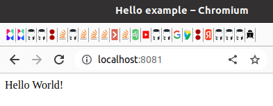
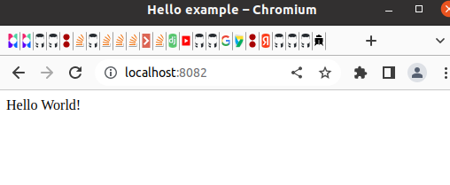
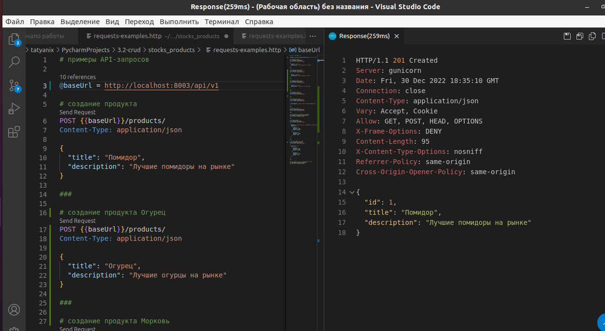

# Домашнее задание к лекции «Docker»

Инструкцию по сдаче домашнего задания вы найдете на главной странице репозитория. 

## Задание 1

По аналогии с практикой из лекции создайте свой docker image с http сервером nginx. Замените страницу приветсвия Nginx на своё (измените текст приветствия на той же странице).

<details>
<summary>Подсказки:</summary>
В официальном образе nginx стандартный путь к статичным файлам `/usr/share/nginx/html`.  
</details>

На проверку присылается GitHub-репозиторий с Dockerfile и статичными файлами для него.

> Для пользовательского html можно использовать пример в [каталоге](html/) с ДЗ.

## Задание 2

Создайте контейнер для REST API сервера любого вашего проекта из курса по Django (например, [CRUD: Склады и запасы](https://github.com/netology-code/dj-homeworks/tree/drf/3.2-crud/stocks_products)).

> **ВАЖНО**: поменяйте БД с postgresql на sqlite3. Чтобы ваш контейнер мог работать без зависимости от postgres (с этим мы разберемся на следующем занятии).

Проверьте конфигурацию Django на использование переменных окружения (environment).

- Приложите в репозиторий Dockerfile и файлы приложения.
- В README.md описать типовые команды для запуска контейнера c backend-сервером.

> Для проверки работоспособности вашего контейнера отправляйте запросы с помощью `VS Code REST Client` или `Postman`.


# Ответ:

## Задание 1

Для выполнения задания переместимся в папку nginx:
```shell
cd ./nginx
```
В папке находится [Dockerfile](nginx/Dockerfile), запускаем создание и выполнение контейнер:

```shell
tatyanix@tatyanix-toshiba:~/PycharmProjects/1.3-docker/nginx$ docker build -t netology-nginx .
Sending build context to Docker daemon  3.584kB
Step 1/2 : FROM nginx:latest
 ---> 1403e55ab369
Step 2/2 : COPY ./html/index.html /usr/share/nginx/html/index.html
 ---> Using cache
 ---> debca9ed7c4e
Successfully built debca9ed7c4e
Successfully tagged netology-nginx:latest
tatyanix@tatyanix-toshiba:~/PycharmProjects/1.3-docker/nginx$ docker run --name netology-nginx-server -d -p 8081:80  -d netology-nginx
946efe64472e7ceec4e983929263219466d51207766ca4b8cca0db2709da5559
tatyanix@tatyanix-toshiba:~/PycharmProjects/1.3-docker/nginx$ docker ps 
CONTAINER ID   IMAGE            COMMAND                  CREATED              STATUS              PORTS                                   NAMES
946efe64472e   netology-nginx   "/docker-entrypoint.…"   About a minute ago   Up About a minute   0.0.0.0:8081->80/tcp, :::8081->80/tcp   netology-nginx-server
tatyanix@tatyanix-toshiba:~/PycharmProjects/1.3-docker/nginx$ 
```




 вариант 2 - можно не использовать Dockerfile

```shell
docker run --name netology-nginx-server2 -d --volume "$PWD/PycharmProjects/1.3-docker/nginx/:/usr/share/nginx" -p 8082:80 nginx:latest
```




## Задание 2

Для выполнения задания переместимся в папку python:
```shell
cd ./python
```
В [Dockerfile](python/Dockerfile) описано 2 контейнера, первый подготовительный скачивает [проект](https://github.com/kapustina-tatyana/3.2-stock_product_docker) из git, второй на основе образа python:3.9 копирует подготовленный [проект](https://github.com/kapustina-tatyana/3.2-stock_product_docker) и запускает его.
<details>
  <summary>Листинг создания образа и запуска контейнера (кликабельно)</summary></summary>

```shell
tahttps://github.com/kapustina-ttyanix@tatyanix-toshiba:~/PycharmProjects/1.3-docker/python$ docker build . --tag stock_product:0.0.1
Sending build context to Docker daemon  2.048kB
Step 1/13 : FROM alpine as pull_git
 ---> 49176f190c7e
Step 2/13 : RUN apk add git
 ---> Running in e7542ea75b9a
fetch https://dl-cdn.alpinelinux.org/alpine/v3.17/main/x86_64/APKINDEX.tar.gz
fetch https://dl-cdn.alpinelinux.org/alpine/v3.17/community/x86_64/APKINDEX.tar.gz
(1/7) Installing ca-certificates (20220614-r3)
(2/7) Installing brotli-libs (1.0.9-r9)
(3/7) Installing nghttp2-libs (1.51.0-r0)
(4/7) Installing libcurl (7.87.0-r0)
(5/7) Installing libexpat (2.5.0-r0)
(6/7) Installing pcre2 (10.42-r0)
(7/7) Installing git (2.38.2-r0)
Executing busybox-1.35.0-r29.trigger
Executing ca-certificates-20220614-r3.trigger
OK: 16 MiB in 22 packages
Removing intermediate container e7542ea75b9a
 ---> 029b9c2eebe4
Step 3/13 : RUN git clone https://github.com/kapustina-tatyana/3.2-stock_product_docker.git /stock
 ---> Running in c1e213a14852
Cloning into '/stock'...
Removing intermediate container c1e213a14852
 ---> 640639e40950
Step 4/13 : FROM python:3.9
 ---> 68cf04410baf
Step 5/13 : WORKDIR /stock
 ---> Using cache
 ---> e7640ce1fcd0
Step 6/13 : COPY --from=pull_git /stock /stock
 ---> 7fd5094a59ad
Step 7/13 : ENV SECRET_KEY 'django-verysecure-nw^y+m^wmxza1asgk+)!ua2qx9)g+#v=6%76-9i8i(6eqiw94j'
 ---> Running in 6e5c9e7b3329
Removing intermediate container 6e5c9e7b3329
 ---> c32138a4496d
Step 8/13 : ENV DEBUG 1
 ---> Running in 7b53f5caf301
Removing intermediate container 7b53f5caf301
 ---> 408fb25ffa24
Step 9/13 : RUN python -m pip install --upgrade pip
 ---> Running in 9a1a99ce4ab8
Requirement already satisfied: pip in /usr/local/lib/python3.9/site-packages (22.0.4)
Collecting pip
  Downloading pip-22.3.1-py3-none-any.whl (2.1 MB)
     ━━━━━━━━━━━━━━━━━━━━━━━━━━━━━━━━━━━━━━━━ 2.1/2.1 MB 648.4 kB/s eta 0:00:00
Installing collected packages: pip
  Attempting uninstall: pip
    Found existing installation: pip 22.0.4
    Uninstalling pip-22.0.4:
      Successfully uninstalled pip-22.0.4
Successfully installed pip-22.3.1
WARNING: Running pip as the 'root' user can result in broken permissions and conflicting behaviour with the system package manager. It is recommended to use a virtual environment instead: https://pip.pypa.io/warnings/venv
Removing intermediate container 9a1a99ce4ab8
 ---> 1812b3a1a9be
Step 10/13 : RUN ls -lh /stock/
 ---> Running in 9c213c9f6b19
total 24K
-rw-r--r-- 1 root root 3.8K Dec 30 18:40 README.md
drwxr-xr-x 4 root root 4.0K Dec 30 18:40 logistic
-rw-r--r-- 1 root root  671 Dec 30 18:40 manage.py
-rw-r--r-- 1 root root 1.7K Dec 30 18:40 requests-examples.http
-rw-r--r-- 1 root root   66 Dec 30 18:40 requirements.txt
drwxr-xr-x 3 root root 4.0K Dec 30 18:40 stocks_products
Removing intermediate container 9c213c9f6b19
 ---> 1f305d8ec0f5
Step 11/13 : RUN python -m pip install -r requirements.txt
 ---> Running in b18b54975656
Collecting django
  Downloading Django-4.1.4-py3-none-any.whl (8.1 MB)
     ━━━━━━━━━━━━━━━━━━━━━━━━━━━━━━━━━━━━━━━━ 8.1/8.1 MB 1.2 MB/s eta 0:00:00
Collecting djangorestframework
  Downloading djangorestframework-3.14.0-py3-none-any.whl (1.1 MB)
     ━━━━━━━━━━━━━━━━━━━━━━━━━━━━━━━━━━━━━━━━ 1.1/1.1 MB 1.7 MB/s eta 0:00:00
Collecting psycopg2-binary
  Downloading psycopg2_binary-2.9.5-cp39-cp39-manylinux_2_17_x86_64.manylinux2014_x86_64.whl (3.0 MB)
     ━━━━━━━━━━━━━━━━━━━━━━━━━━━━━━━━━━━━━━━━ 3.0/3.0 MB 2.2 MB/s eta 0:00:00
Collecting django-filter
  Downloading django_filter-22.1-py3-none-any.whl (80 kB)
     ━━━━━━━━━━━━━━━━━━━━━━━━━━━━━━━━━━━━━━━━ 80.9/80.9 kB 1.7 MB/s eta 0:00:00
Collecting gunicorn
  Downloading gunicorn-20.1.0-py3-none-any.whl (79 kB)
     ━━━━━━━━━━━━━━━━━━━━━━━━━━━━━━━━━━━━━━━━ 79.5/79.5 kB 1.8 MB/s eta 0:00:00
Collecting asgiref<4,>=3.5.2
  Downloading asgiref-3.6.0-py3-none-any.whl (23 kB)
Collecting sqlparse>=0.2.2
  Downloading sqlparse-0.4.3-py3-none-any.whl (42 kB)
     ━━━━━━━━━━━━━━━━━━━━━━━━━━━━━━━━━━━━━━━━ 42.8/42.8 kB 1.0 MB/s eta 0:00:00
Collecting pytz
  Downloading pytz-2022.7-py2.py3-none-any.whl (499 kB)
     ━━━━━━━━━━━━━━━━━━━━━━━━━━━━━━━━━━━━━━━ 499.4/499.4 kB 2.6 MB/s eta 0:00:00
Requirement already satisfied: setuptools>=3.0 in /usr/local/lib/python3.9/site-packages (from gunicorn->-r requirements.txt (line 5)) (58.1.0)
Installing collected packages: pytz, sqlparse, psycopg2-binary, gunicorn, asgiref, django, djangorestframework, django-filter
Successfully installed asgiref-3.6.0 django-4.1.4 django-filter-22.1 djangorestframework-3.14.0 gunicorn-20.1.0 psycopg2-binary-2.9.5 pytz-2022.7 sqlparse-0.4.3
WARNING: Running pip as the 'root' user can result in broken permissions and conflicting behaviour with the system package manager. It is recommended to use a virtual environment instead: https://pip.pypa.io/warnings/venv
Removing intermediate container b18b54975656
 ---> b4fed028dc29
Step 12/13 : RUN python manage.py migrate
 ---> Running in 80dbc435cb06
Operations to perform:
  Apply all migrations: admin, auth, contenttypes, logistic, sessions
Running migrations:
  Applying contenttypes.0001_initial... OK
  Applying auth.0001_initial... OK
  Applying admin.0001_initial... OK
  Applying admin.0002_logentry_remove_auto_add... OK
  Applying admin.0003_logentry_add_action_flag_choices... OK
  Applying contenttypes.0002_remove_content_type_name... OK
  Applying auth.0002_alter_permission_name_max_length... OK
  Applying auth.0003_alter_user_email_max_length... OK
  Applying auth.0004_alter_user_username_opts... OK
  Applying auth.0005_alter_user_last_login_null... OK
  Applying auth.0006_require_contenttypes_0002... OK
  Applying auth.0007_alter_validators_add_error_messages... OK
  Applying auth.0008_alter_user_username_max_length... OK
  Applying auth.0009_alter_user_last_name_max_length... OK
  Applying auth.0010_alter_group_name_max_length... OK
  Applying auth.0011_update_proxy_permissions... OK
  Applying auth.0012_alter_user_first_name_max_length... OK
  Applying logistic.0001_initial... OK
  Applying sessions.0001_initial... OK
Removing intermediate container 80dbc435cb06
 ---> 701e749eb4fa
Step 13/13 : CMD ["gunicorn", "--bind", "0.0.0.0:8000", "stocks_products.wsgi"]
 ---> Running in d6ed158f36ca
Removing intermediate container d6ed158f36ca
 ---> 8c15deff325d
Successfully built 8c15deff325d
Successfully tagged stock_product:0.0.1
tatyanix@tatyanix-toshiba:~/PycharmProjects/1.3-docker/python$ docker run --name my_stockproducts -d -p 8003:8000 stock_product:0.0.1
50a57ef83a1182061911d1691f5281ca9352bf96cf2a492316768a6b04363210
tatyanix@tatyanix-toshiba:~/PycharmProjects/1.3-docker/python$ docker ps
CONTAINER ID   IMAGE                 COMMAND                  CREATED         STATUS         PORTS                                       NAMES
50a57ef83a11   stock_product:0.0.1   "gunicorn --bind 0.0…"   6 seconds ago   Up 4 seconds   0.0.0.0:8003->8000/tcp, :::8003->8000/tcp   my_stockproducts
```
</details>

После запуска команды:

```shell
docker build . --tag stock_product:0.0.1
```
и команды

```shell
docker run --name my_stockproducts -d -p 8003:8000 stock_product:0.0.1
```
Стартует образ:

```shell
tatyanix@tatyanix-toshiba:~/PycharmProjects/1.3-docker/python$ docker ps
CONTAINER ID   IMAGE                 COMMAND                  CREATED         STATUS         PORTS                                       NAMES
50a57ef83a11   stock_product:0.0.1   "gunicorn --bind 0.0…"   8 minutes ago   Up 8 minutes   0.0.0.0:8003->8000/tcp, :::8003->8000/tcp   my_stockproducts
```

Проверим работу api с помощью [requests-examples.http](https://github.com/kapustina-tatyana/3.2-stock_product_docker/blob/main/requests-examples.http)


Единственный минус такого решения, pull_git образ не видит, произошли ли изменения в гит-репозитории, поэтому для создания новой версии приложения из git, требуется выполнить команду:

```shell
docker image prune
```
если это нежелательно, т.к. есть нужные образы, можно удалить конкретный:
```shell
docker rmi alpine:latest
```

если и это нежелательно, т.к. при последующем билде образ будет скачен заново и в нем опять будет установлен git.

То внести изменения в команду:

```shell
RUN echo "version 0.0.1"
```
исправив версию, само значении версии не важно, но докер обнаружит, что команда поменялась и после нее выполнит все действия заново.
